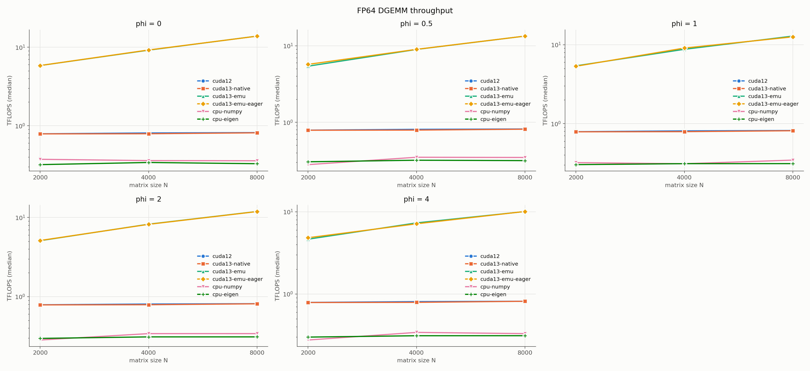
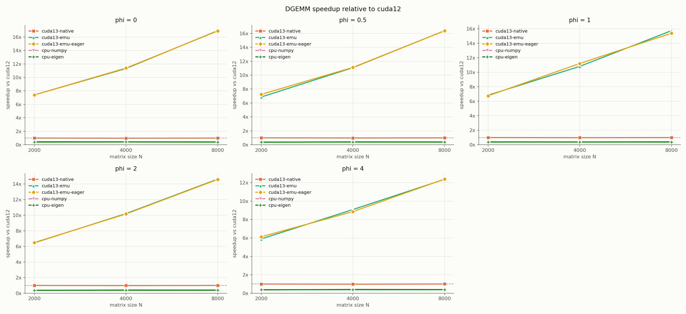
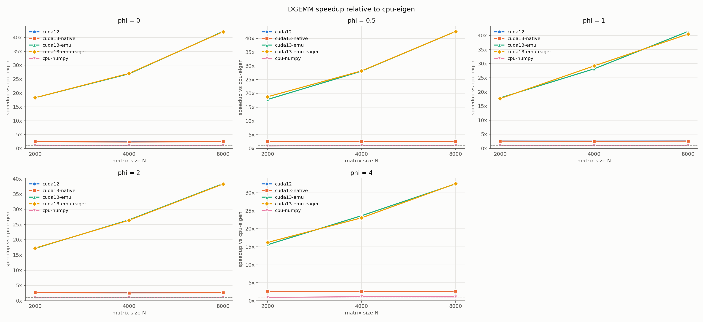
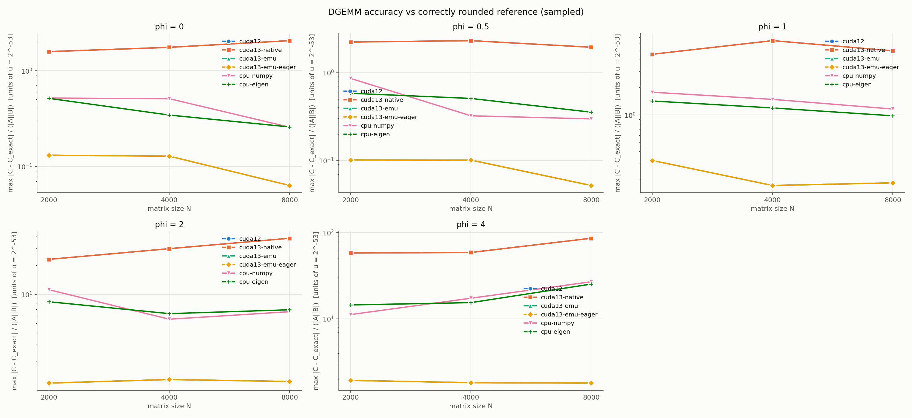
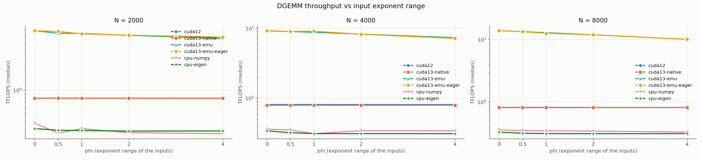
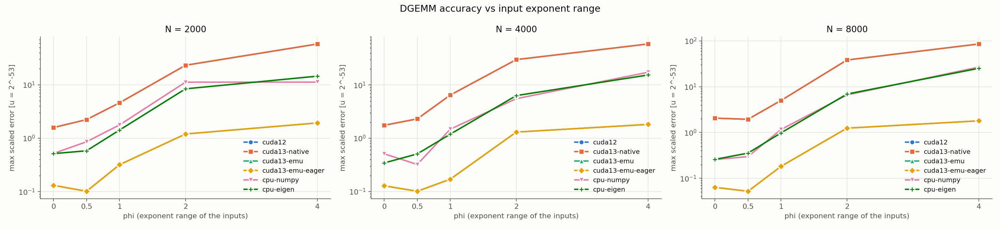

# CUDA 12 vs CUDA 13.4 (Ozaki scheme) FP64 benchmark report

- conditions: cuda12, cuda13-native, cuda13-emu, cuda13-emu-eager, cpu-numpy, cpu-eigen
- baseline for speedup: `cuda12`; emulation effect isolated against `cuda13-native`; CPU reference `cpu-eigen`

## Environment

| condition | GPU (cc) | kernel driver | libcuda (API) | CUDA toolkit | cuBLAS | CuPy | NumPy | emulation env | libcublas |
|---|---|---|---|---|---|---|---|---|---|
| cuda12 | NVIDIA GeForce RTX 5080 (12.0) | 590.48.01 | libcuda.so.590.48.01 (13.1) | 12.9.1 | 120901 | 14.2.0 | 2.2.6 | (unset) | /usr/local/cuda-12.9/targets/x86_64-linux/lib/libcublas.so.12.9.1.4 /usr/local/cuda-12.9/targets/x86_64-linux/lib/libcublasLt.so.12.9.1.4 |
| cuda13-native | NVIDIA GeForce RTX 5080 (12.0) | 590.48.01 | libcuda.so.590.48.01 (13.1) | 13.4.2 | 130800 | 14.2.0 | 2.2.6 | EMULATE_DOUBLE_PRECISION=0 | /usr/local/cuda-13.4/targets/x86_64-linux/lib/libcublas.so.13.8.0.4 /usr/local/cuda-13.4/targets/x86_64-linux/lib/libcublasLt.so.13.8.0.4 |
| cuda13-emu | NVIDIA GeForce RTX 5080 (12.0) | 590.48.01 | libcuda.so.590.48.01 (13.1) | 13.4.2 | 130800 | 14.2.0 | 2.2.6 | EMULATE_DOUBLE_PRECISION=1, EMULATION_STRATEGY=performant | /usr/local/cuda-13.4/targets/x86_64-linux/lib/libcublas.so.13.8.0.4 /usr/local/cuda-13.4/targets/x86_64-linux/lib/libcublasLt.so.13.8.0.4 |
| cuda13-emu-eager | NVIDIA GeForce RTX 5080 (12.0) | 590.48.01 | libcuda.so.590.48.01 (13.1) | 13.4.2 | 130800 | 14.2.0 | 2.2.6 | EMULATE_DOUBLE_PRECISION=1, EMULATION_STRATEGY=eager | /usr/local/cuda-13.4/targets/x86_64-linux/lib/libcublas.so.13.8.0.4 /usr/local/cuda-13.4/targets/x86_64-linux/lib/libcublasLt.so.13.8.0.4 |

| condition | CPU | cores | Eigen (AVX2 / FMA) | compiler | BLAS (NumPy) | OpenMP binding |
|---|---|---:|---|---|---|---|
| cpu-numpy | Intel(R) Core(TM) Ultra 9 285H | 16 | 3.4.0 (True / True) | g++ 13.3.0 | openblas 0.3.29 (Haswell) | OMP_PLACES=cores, OMP_PROC_BIND=close |
| cpu-eigen | Intel(R) Core(TM) Ultra 9 285H | 16 | 3.4.0 (True / True) | g++ 13.3.0 | openblas 0.3.29 (Haswell) | OMP_PLACES=cores, OMP_PROC_BIND=close |

Speedups are ratios of median times. Errors: *rel err vs NumPy* = max|C-C_np| / max|C_np|;
*scaled err* = max over sampled entries of |c_ij - exact_ij| / (|A||B|)_ij in units of u = 2^-53.

## DGEMM

| phi | N | condition | threads | median [s] | TFLOPS | speedup vs cuda12 | speedup vs cuda13-native | speedup vs cpu-eigen | rel err vs NumPy | max scaled err [u] (result / NumPy) |
|---:|---:|---|---:|---:|---:|---:|---:|---:|---:|---:|
| 0 | 2000 | cuda12 | - | 0.0203 | 0.790 | 1.00x | 1.00x | 2.47x | 3.76e-15 | 1.58 / 0.52 |
| 0 | 2000 | cuda13-native | - | 0.0203 | 0.787 | 1.00x | 1.00x | 2.46x | 3.76e-15 | 1.58 / 0.52 |
| 0 | 2000 | cuda13-emu | - | 0.0027 | 5.841 | 7.40x | 7.42x | 18.26x | 8.35e-16 | 0.13 / 0.52 |
| 0 | 2000 | cuda13-emu-eager | - | 0.0027 | 5.844 | 7.40x | 7.42x | 18.27x | 8.35e-16 | 0.13 / 0.52 |
| 0 | 2000 | cpu-numpy | 14 | 0.0428 | 0.374 | 0.47x | 0.47x | 1.17x | 6.50e-16 | 0.52 / 0.52 |
| 0 | 2000 | cpu-eigen | 14 | 0.0500 | 0.320 | 0.41x | 0.41x | 1.00x | 9.40e-16 | 0.51 / 0.52 |
| 0 | 4000 | cuda12 | - | 0.1581 | 0.809 | 1.00x | 1.02x | 2.38x | 5.24e-15 | 1.75 / 0.51 |
| 0 | 4000 | cuda13-native | - | 0.1619 | 0.791 | 0.98x | 1.00x | 2.32x | 5.24e-15 | 1.75 / 0.51 |
| 0 | 4000 | cuda13-emu | - | 0.0140 | 9.164 | 11.32x | 11.59x | 26.91x | 6.99e-16 | 0.13 / 0.51 |
| 0 | 4000 | cuda13-emu-eager | - | 0.0139 | 9.215 | 11.39x | 11.66x | 27.06x | 6.99e-16 | 0.13 / 0.51 |
| 0 | 4000 | cpu-numpy | 14 | 0.3557 | 0.360 | 0.44x | 0.46x | 1.06x | 6.70e-16 | 0.51 / 0.51 |
| 0 | 4000 | cpu-eigen | 14 | 0.3759 | 0.341 | 0.42x | 0.43x | 1.00x | 9.32e-16 | 0.34 / 0.51 |
| 0 | 8000 | cuda12 | - | 1.2519 | 0.818 | 1.00x | 1.01x | 2.49x | 7.80e-15 | 2.06 / 0.26 |
| 0 | 8000 | cuda13-native | - | 1.2608 | 0.812 | 0.99x | 1.00x | 2.47x | 7.80e-15 | 2.06 / 0.26 |
| 0 | 8000 | cuda13-emu | - | 0.0739 | 13.852 | 16.94x | 17.06x | 42.18x | 6.78e-16 | 0.06 / 0.26 |
| 0 | 8000 | cuda13-emu-eager | - | 0.0741 | 13.817 | 16.89x | 17.01x | 42.07x | 6.78e-16 | 0.06 / 0.26 |
| 0 | 8000 | cpu-numpy | 14 | 2.8602 | 0.358 | 0.44x | 0.44x | 1.09x | 5.93e-16 | 0.26 / 0.26 |
| 0 | 8000 | cpu-eigen | 14 | 3.1178 | 0.328 | 0.40x | 0.40x | 1.00x | 9.32e-16 | 0.26 / 0.26 |
| 0.5 | 2000 | cuda12 | - | 0.0203 | 0.790 | 1.00x | 1.00x | 2.59x | 4.08e-15 | 2.23 / 0.86 |
| 0.5 | 2000 | cuda13-native | - | 0.0203 | 0.787 | 1.00x | 1.00x | 2.59x | 4.08e-15 | 2.23 / 0.86 |
| 0.5 | 2000 | cuda13-emu | - | 0.0030 | 5.418 | 6.86x | 6.88x | 17.79x | 7.94e-16 | 0.10 / 0.86 |
| 0.5 | 2000 | cuda13-emu-eager | - | 0.0028 | 5.717 | 7.24x | 7.26x | 18.78x | 7.94e-16 | 0.10 / 0.86 |
| 0.5 | 2000 | cpu-numpy | 14 | 0.0572 | 0.280 | 0.35x | 0.36x | 0.92x | 5.96e-16 | 0.86 / 0.86 |
| 0.5 | 2000 | cpu-eigen | 14 | 0.0525 | 0.305 | 0.39x | 0.39x | 1.00x | 9.07e-16 | 0.58 / 0.86 |
| 0.5 | 4000 | cuda12 | - | 0.1582 | 0.809 | 1.00x | 1.02x | 2.54x | 4.95e-15 | 2.31 / 0.32 |
| 0.5 | 4000 | cuda13-native | - | 0.1619 | 0.791 | 0.98x | 1.00x | 2.48x | 4.95e-15 | 2.31 / 0.32 |
| 0.5 | 4000 | cuda13-emu | - | 0.0143 | 8.966 | 11.08x | 11.34x | 28.09x | 8.00e-16 | 0.10 / 0.32 |
| 0.5 | 4000 | cuda13-emu-eager | - | 0.0142 | 8.995 | 11.11x | 11.38x | 28.19x | 8.00e-16 | 0.10 / 0.32 |
| 0.5 | 4000 | cpu-numpy | 14 | 0.3667 | 0.349 | 0.43x | 0.44x | 1.09x | 6.09e-16 | 0.32 / 0.32 |
| 0.5 | 4000 | cpu-eigen | 14 | 0.4011 | 0.319 | 0.39x | 0.40x | 1.00x | 9.14e-16 | 0.51 / 0.32 |
| 0.5 | 8000 | cuda12 | - | 1.2519 | 0.818 | 1.00x | 1.01x | 2.59x | 8.19e-15 | 1.94 / 0.30 |
| 0.5 | 8000 | cuda13-native | - | 1.2609 | 0.812 | 0.99x | 1.00x | 2.57x | 8.19e-15 | 1.94 / 0.30 |
| 0.5 | 8000 | cuda13-emu | - | 0.0764 | 13.404 | 16.39x | 16.50x | 42.49x | 6.99e-16 | 0.05 / 0.30 |
| 0.5 | 8000 | cuda13-emu-eager | - | 0.0764 | 13.408 | 16.39x | 16.51x | 42.50x | 6.99e-16 | 0.05 / 0.30 |
| 0.5 | 8000 | cpu-numpy | 14 | 2.9529 | 0.347 | 0.42x | 0.43x | 1.10x | 5.49e-16 | 0.30 / 0.30 |
| 0.5 | 8000 | cpu-eigen | 14 | 3.2461 | 0.315 | 0.39x | 0.39x | 1.00x | 8.99e-16 | 0.35 / 0.30 |
| 1 | 2000 | cuda12 | - | 0.0203 | 0.790 | 1.00x | 1.00x | 2.62x | 2.22e-15 | 4.59 / 1.77 |
| 1 | 2000 | cuda13-native | - | 0.0203 | 0.787 | 1.00x | 1.00x | 2.60x | 2.22e-15 | 4.59 / 1.77 |
| 1 | 2000 | cuda13-emu | - | 0.0030 | 5.401 | 6.84x | 6.86x | 17.88x | 5.35e-16 | 0.32 / 1.77 |
| 1 | 2000 | cuda13-emu-eager | - | 0.0030 | 5.333 | 6.75x | 6.78x | 17.66x | 5.35e-16 | 0.32 / 1.77 |
| 1 | 2000 | cpu-numpy | 14 | 0.0500 | 0.320 | 0.41x | 0.41x | 1.06x | 2.25e-16 | 1.77 / 1.77 |
| 1 | 2000 | cpu-eigen | 14 | 0.0530 | 0.302 | 0.38x | 0.38x | 1.00x | 5.13e-16 | 1.42 / 1.77 |
| 1 | 4000 | cuda12 | - | 0.1582 | 0.809 | 1.00x | 1.02x | 2.60x | 6.71e-15 | 6.46 / 1.48 |
| 1 | 4000 | cuda13-native | - | 0.1619 | 0.791 | 0.98x | 1.00x | 2.54x | 6.71e-15 | 6.46 / 1.48 |
| 1 | 4000 | cuda13-emu | - | 0.0146 | 8.752 | 10.82x | 11.07x | 28.17x | 9.76e-16 | 0.17 / 1.48 |
| 1 | 4000 | cuda13-emu-eager | - | 0.0141 | 9.075 | 11.21x | 11.48x | 29.21x | 9.76e-16 | 0.17 / 1.48 |
| 1 | 4000 | cpu-numpy | 14 | 0.4129 | 0.310 | 0.38x | 0.39x | 1.00x | 5.49e-16 | 1.48 / 1.48 |
| 1 | 4000 | cpu-eigen | 14 | 0.4120 | 0.311 | 0.38x | 0.39x | 1.00x | 1.34e-15 | 1.19 / 1.48 |
| 1 | 8000 | cuda12 | - | 1.2522 | 0.818 | 1.00x | 1.01x | 2.63x | 6.52e-15 | 5.01 / 1.16 |
| 1 | 8000 | cuda13-native | - | 1.2608 | 0.812 | 0.99x | 1.00x | 2.61x | 6.52e-15 | 5.01 / 1.16 |
| 1 | 8000 | cuda13-emu | - | 0.0796 | 12.871 | 15.74x | 15.85x | 41.40x | 1.02e-15 | 0.18 / 1.16 |
| 1 | 8000 | cuda13-emu-eager | - | 0.0814 | 12.585 | 15.39x | 15.50x | 40.48x | 1.02e-15 | 0.18 / 1.16 |
| 1 | 8000 | cpu-numpy | 14 | 2.9717 | 0.345 | 0.42x | 0.42x | 1.11x | 3.84e-16 | 1.16 / 1.16 |
| 1 | 8000 | cpu-eigen | 14 | 3.2937 | 0.311 | 0.38x | 0.38x | 1.00x | 7.67e-16 | 0.98 / 1.16 |
| 2 | 2000 | cuda12 | - | 0.0203 | 0.790 | 1.00x | 1.00x | 2.66x | 8.11e-16 | 23.15 / 11.19 |
| 2 | 2000 | cuda13-native | - | 0.0203 | 0.787 | 1.00x | 1.00x | 2.65x | 8.11e-16 | 23.15 / 11.19 |
| 2 | 2000 | cuda13-emu | - | 0.0031 | 5.094 | 6.45x | 6.47x | 17.16x | 3.60e-16 | 1.20 / 11.19 |
| 2 | 2000 | cuda13-emu-eager | - | 0.0031 | 5.126 | 6.49x | 6.52x | 17.27x | 3.60e-16 | 1.20 / 11.19 |
| 2 | 2000 | cpu-numpy | 14 | 0.0565 | 0.283 | 0.36x | 0.36x | 0.95x | 4.50e-17 | 11.19 / 11.19 |
| 2 | 2000 | cpu-eigen | 14 | 0.0539 | 0.297 | 0.38x | 0.38x | 1.00x | 9.01e-16 | 8.39 / 11.19 |
| 2 | 4000 | cuda12 | - | 0.1586 | 0.807 | 1.00x | 1.02x | 2.60x | 3.99e-15 | 29.90 / 5.53 |
| 2 | 4000 | cuda13-native | - | 0.1619 | 0.790 | 0.98x | 1.00x | 2.55x | 3.99e-15 | 29.90 / 5.53 |
| 2 | 4000 | cuda13-emu | - | 0.0155 | 8.237 | 10.20x | 10.42x | 26.55x | 3.32e-16 | 1.31 / 5.53 |
| 2 | 4000 | cuda13-emu-eager | - | 0.0156 | 8.199 | 10.16x | 10.37x | 26.42x | 3.32e-16 | 1.31 / 5.53 |
| 2 | 4000 | cpu-numpy | 14 | 0.3751 | 0.341 | 0.42x | 0.43x | 1.10x | 2.77e-17 | 5.53 / 5.53 |
| 2 | 4000 | cpu-eigen | 14 | 0.4125 | 0.310 | 0.38x | 0.39x | 1.00x | 2.95e-16 | 6.32 / 5.53 |
| 2 | 8000 | cuda12 | - | 1.2556 | 0.816 | 1.00x | 1.00x | 2.63x | 7.50e-16 | 38.35 / 6.61 |
| 2 | 8000 | cuda13-native | - | 1.2607 | 0.812 | 1.00x | 1.00x | 2.62x | 7.50e-16 | 38.35 / 6.61 |
| 2 | 8000 | cuda13-emu | - | 0.0859 | 11.924 | 14.62x | 14.68x | 38.42x | 2.40e-16 | 1.24 / 6.61 |
| 2 | 8000 | cuda13-emu-eager | - | 0.0861 | 11.891 | 14.58x | 14.64x | 38.31x | 2.40e-16 | 1.24 / 6.61 |
| 2 | 8000 | cpu-numpy | 14 | 3.0017 | 0.341 | 0.42x | 0.42x | 1.10x | 1.88e-18 | 6.61 / 6.61 |
| 2 | 8000 | cpu-eigen | 14 | 3.2993 | 0.310 | 0.38x | 0.38x | 1.00x | 1.20e-16 | 6.92 / 6.61 |
| 4 | 2000 | cuda12 | - | 0.0203 | 0.789 | 1.00x | 1.00x | 2.64x | 7.13e-16 | 57.94 / 11.21 |
| 4 | 2000 | cuda13-native | - | 0.0203 | 0.787 | 1.00x | 1.00x | 2.64x | 7.13e-16 | 57.94 / 11.21 |
| 4 | 2000 | cuda13-emu | - | 0.0034 | 4.645 | 5.88x | 5.90x | 15.56x | 3.17e-16 | 1.93 / 11.21 |
| 4 | 2000 | cuda13-emu-eager | - | 0.0033 | 4.835 | 6.13x | 6.14x | 16.20x | 3.17e-16 | 1.93 / 11.21 |
| 4 | 2000 | cpu-numpy | 14 | 0.0581 | 0.275 | 0.35x | 0.35x | 0.92x | 3.96e-17 | 11.21 / 11.21 |
| 4 | 2000 | cpu-eigen | 14 | 0.0536 | 0.299 | 0.38x | 0.38x | 1.00x | 6.34e-16 | 14.49 / 11.21 |
| 4 | 4000 | cuda12 | - | 0.1586 | 0.807 | 1.00x | 1.02x | 2.60x | 1.04e-15 | 58.77 / 17.34 |
| 4 | 4000 | cuda13-native | - | 0.1619 | 0.791 | 0.98x | 1.00x | 2.55x | 1.04e-15 | 58.77 / 17.34 |
| 4 | 4000 | cuda13-emu | - | 0.0175 | 7.330 | 9.08x | 9.27x | 23.63x | 6.14e-16 | 1.82 / 17.34 |
| 4 | 4000 | cuda13-emu-eager | - | 0.0179 | 7.149 | 8.86x | 9.04x | 23.05x | 6.14e-16 | 1.82 / 17.34 |
| 4 | 4000 | cpu-numpy | 14 | 0.3758 | 0.341 | 0.42x | 0.43x | 1.10x | 7.67e-18 | 17.34 / 17.34 |
| 4 | 4000 | cpu-eigen | 14 | 0.4127 | 0.310 | 0.38x | 0.39x | 1.00x | 4.91e-16 | 15.41 / 17.34 |
| 4 | 8000 | cuda12 | - | 1.2556 | 0.816 | 1.00x | 1.00x | 2.63x | 2.12e-15 | 85.90 / 26.92 |
| 4 | 8000 | cuda13-native | - | 1.2572 | 0.815 | 1.00x | 1.00x | 2.62x | 2.12e-15 | 85.90 / 26.92 |
| 4 | 8000 | cuda13-emu | - | 0.1016 | 10.084 | 12.36x | 12.38x | 32.49x | 6.64e-17 | 1.80 / 26.92 |
| 4 | 8000 | cuda13-emu-eager | - | 0.1014 | 10.103 | 12.39x | 12.40x | 32.55x | 6.64e-17 | 1.80 / 26.92 |
| 4 | 8000 | cpu-numpy | 14 | 3.1123 | 0.329 | 0.40x | 0.40x | 1.06x | 2.07e-18 | 26.92 / 26.92 |
| 4 | 8000 | cpu-eigen | 14 | 3.2989 | 0.310 | 0.38x | 0.38x | 1.00x | 3.98e-16 | 25.28 / 26.92 |

## CPU thread sweep

`*` = fastest configuration, used in the figures and tables above.

| benchmark | case | condition | threads | median [s] | TFLOPS |
|---|---|---|---:|---:|---:|
| dgemm | phi=0, N=2000 | cpu-numpy | 14 * | 0.0428 | 0.3738 |
| dgemm | phi=0, N=4000 | cpu-numpy | 14 * | 0.3557 | 0.3598 |
| dgemm | phi=0, N=8000 | cpu-numpy | 14 * | 2.8602 | 0.3580 |
| dgemm | phi=0.5, N=2000 | cpu-numpy | 14 * | 0.0572 | 0.2796 |
| dgemm | phi=0.5, N=4000 | cpu-numpy | 14 * | 0.3667 | 0.3491 |
| dgemm | phi=0.5, N=8000 | cpu-numpy | 14 * | 2.9529 | 0.3468 |
| dgemm | phi=1, N=2000 | cpu-numpy | 14 * | 0.0500 | 0.3202 |
| dgemm | phi=1, N=4000 | cpu-numpy | 14 * | 0.4129 | 0.3100 |
| dgemm | phi=1, N=8000 | cpu-numpy | 14 * | 2.9717 | 0.3446 |
| dgemm | phi=2, N=2000 | cpu-numpy | 14 * | 0.0565 | 0.2833 |
| dgemm | phi=2, N=4000 | cpu-numpy | 14 * | 0.3751 | 0.3412 |
| dgemm | phi=2, N=8000 | cpu-numpy | 14 * | 3.0017 | 0.3411 |
| dgemm | phi=4, N=2000 | cpu-numpy | 14 * | 0.0581 | 0.2752 |
| dgemm | phi=4, N=4000 | cpu-numpy | 14 * | 0.3758 | 0.3406 |
| dgemm | phi=4, N=8000 | cpu-numpy | 14 * | 3.1123 | 0.3290 |
| dgemm | phi=0, N=2000 | cpu-eigen | 14 * | 0.0500 | 0.3198 |
| dgemm | phi=0, N=4000 | cpu-eigen | 14 * | 0.3759 | 0.3406 |
| dgemm | phi=0, N=8000 | cpu-eigen | 14 * | 3.1178 | 0.3284 |
| dgemm | phi=0.5, N=2000 | cpu-eigen | 14 * | 0.0525 | 0.3045 |
| dgemm | phi=0.5, N=4000 | cpu-eigen | 14 * | 0.4011 | 0.3192 |
| dgemm | phi=0.5, N=8000 | cpu-eigen | 14 * | 3.2461 | 0.3155 |
| dgemm | phi=1, N=2000 | cpu-eigen | 14 * | 0.0530 | 0.3020 |
| dgemm | phi=1, N=4000 | cpu-eigen | 14 * | 0.4120 | 0.3107 |
| dgemm | phi=1, N=8000 | cpu-eigen | 14 * | 3.2937 | 0.3109 |
| dgemm | phi=2, N=2000 | cpu-eigen | 14 * | 0.0539 | 0.2969 |
| dgemm | phi=2, N=4000 | cpu-eigen | 14 * | 0.4125 | 0.3103 |
| dgemm | phi=2, N=8000 | cpu-eigen | 14 * | 3.2993 | 0.3104 |
| dgemm | phi=4, N=2000 | cpu-eigen | 14 * | 0.0536 | 0.2985 |
| dgemm | phi=4, N=4000 | cpu-eigen | 14 * | 0.4127 | 0.3102 |
| dgemm | phi=4, N=8000 | cpu-eigen | 14 * | 3.2989 | 0.3104 |
