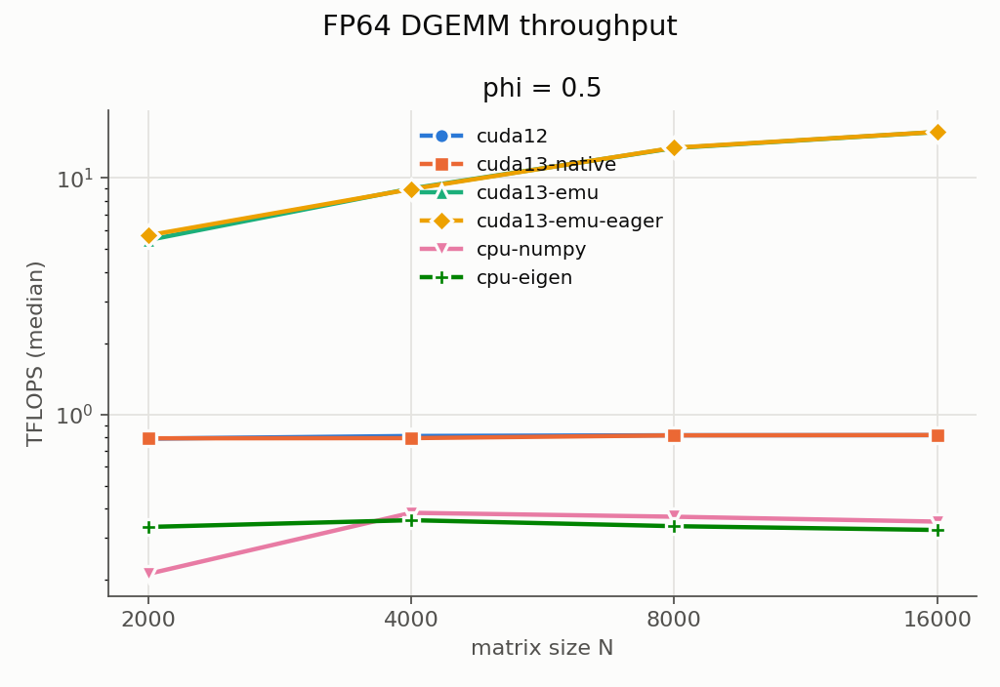
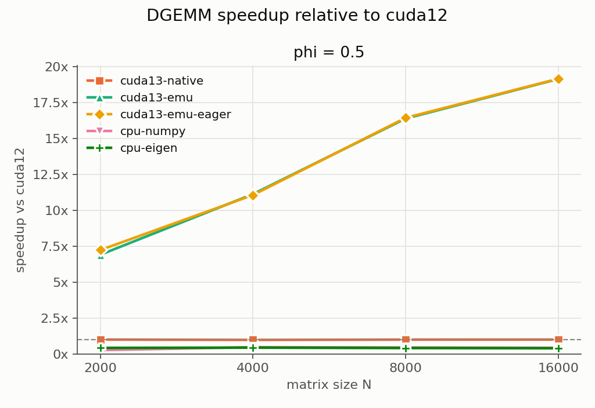
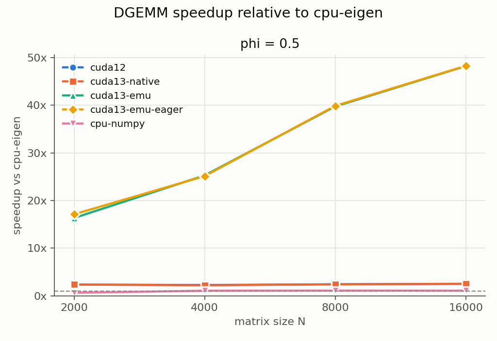
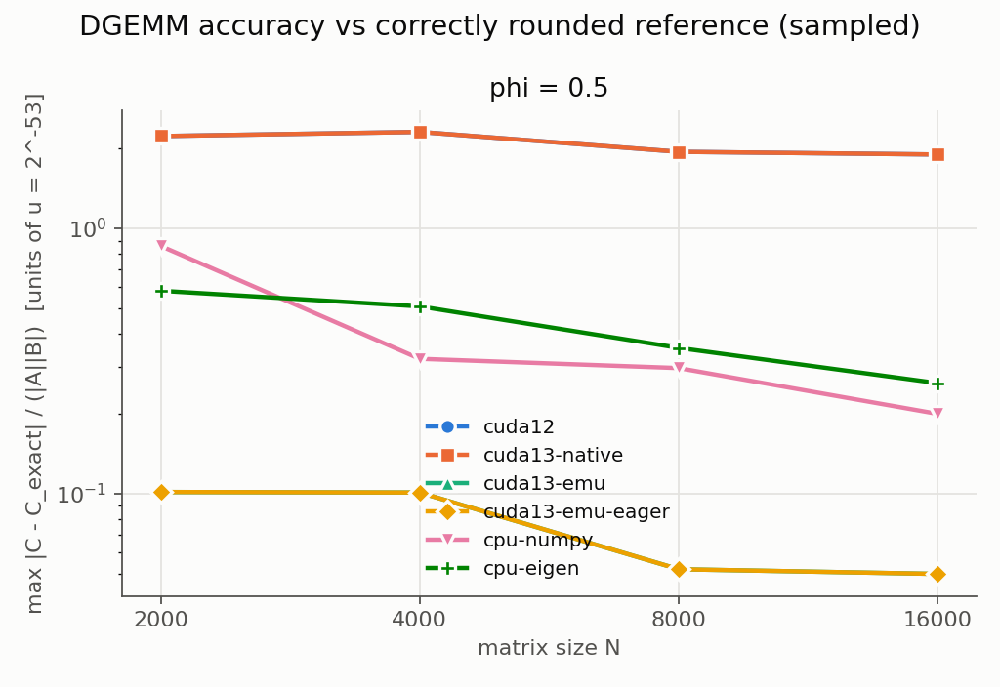
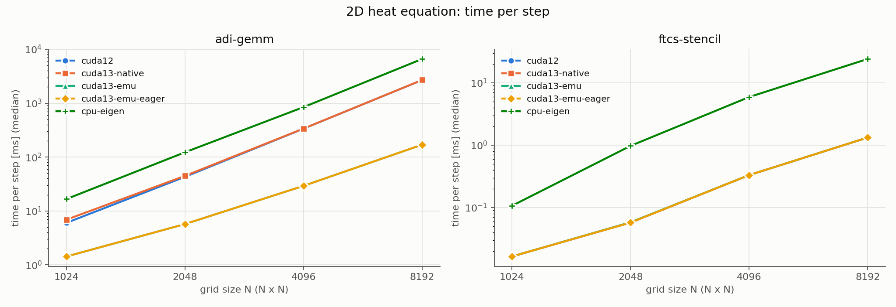
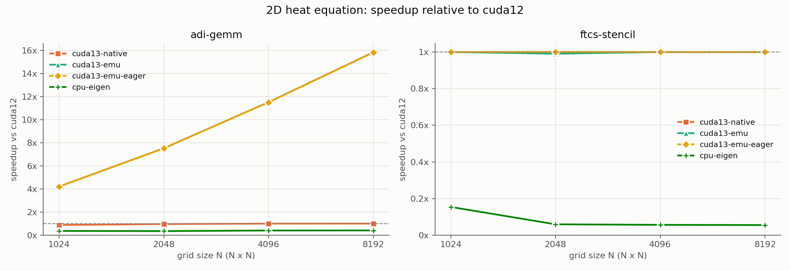
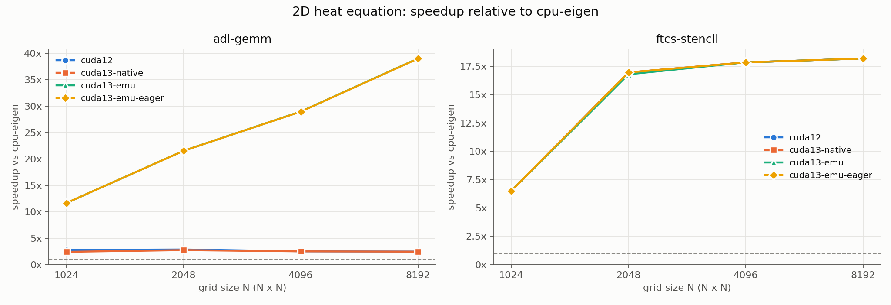

# CUDA 12 vs CUDA 13.4 (Ozaki scheme) FP64 benchmark report

- conditions: cuda12, cuda13-native, cuda13-emu, cuda13-emu-eager, cpu-numpy, cpu-eigen, nsys
- baseline for speedup: `cuda12`; emulation effect isolated against `cuda13-native`; CPU reference `cpu-eigen`

## Environment

| condition | GPU (cc) | kernel driver | libcuda (API) | CUDA toolkit | cuBLAS | CuPy | NumPy | emulation env | libcublas |
|---|---|---|---|---|---|---|---|---|---|
| cuda12 | NVIDIA GeForce RTX 5080 (12.0) | 590.48.01 | libcuda.so.590.48.01 (13.1) | 12.9.1 | 120901 | 14.2.0 | 2.2.6 | (unset) | /usr/local/cuda-12.9/targets/x86_64-linux/lib/libcublas.so.12.9.1.4 /usr/local/cuda-12.9/targets/x86_64-linux/lib/libcublasLt.so.12.9.1.4 |
| cuda13-native | NVIDIA GeForce RTX 5080 (12.0) | 590.48.01 | libcuda.so.590.48.01 (13.1) | 13.4.2 | 130800 | 14.2.0 | 2.2.6 | EMULATE_DOUBLE_PRECISION=0 | /usr/local/cuda-13.4/targets/x86_64-linux/lib/libcublas.so.13.8.0.4 /usr/local/cuda-13.4/targets/x86_64-linux/lib/libcublasLt.so.13.8.0.4 |
| cuda13-emu | NVIDIA GeForce RTX 5080 (12.0) | 590.48.01 | libcuda.so.590.48.01 (13.1) | 13.4.2 | 130800 | 14.2.0 | 2.2.6 | EMULATE_DOUBLE_PRECISION=1, EMULATION_STRATEGY=performant | /usr/local/cuda-13.4/targets/x86_64-linux/lib/libcublas.so.13.8.0.4 /usr/local/cuda-13.4/targets/x86_64-linux/lib/libcublasLt.so.13.8.0.4 |
| cuda13-emu-eager | NVIDIA GeForce RTX 5080 (12.0) | 590.48.01 | libcuda.so.590.48.01 (13.1) | 13.4.2 | 130800 | 14.2.0 | 2.2.6 | EMULATE_DOUBLE_PRECISION=1, EMULATION_STRATEGY=eager | /usr/local/cuda-13.4/targets/x86_64-linux/lib/libcublas.so.13.8.0.4 /usr/local/cuda-13.4/targets/x86_64-linux/lib/libcublasLt.so.13.8.0.4 |

| condition | CPU | cores | Eigen (AVX2 / FMA) | compiler | BLAS (NumPy) | OpenMP binding |
|---|---|---:|---|---|---|---|
| cpu-numpy | Intel(R) Core(TM) Ultra 9 285H | 16 | 3.4.0 (True / True) | g++ 13.3.0 | openblas 0.3.29 (Haswell) | OMP_PLACES=cores, OMP_PROC_BIND=close |
| cpu-eigen | Intel(R) Core(TM) Ultra 9 285H | 16 | 3.4.0 (True / True) | g++ 13.3.0 | openblas 0.3.29 (Haswell) | OMP_PLACES=cores, OMP_PROC_BIND=close |

Speedups are ratios of median times. Errors: *rel err vs NumPy* = max|C-C_np| / max|C_np|;
*scaled err* = max over sampled entries of |c_ij - exact_ij| / (|A||B|)_ij in units of u = 2^-53.

## DGEMM

| phi | N | condition | threads | median [s] | TFLOPS | speedup vs cuda12 | speedup vs cuda13-native | speedup vs cpu-eigen | rel err vs NumPy | max scaled err [u] (result / NumPy) |
|---:|---:|---|---:|---:|---:|---:|---:|---:|---:|---:|
| 0.5 | 2000 | cuda12 | - | 0.0203 | 0.790 | 1.00x | 1.00x | 2.36x | 4.08e-15 | 2.23 / 0.86 |
| 0.5 | 2000 | cuda13-native | - | 0.0202 | 0.792 | 1.00x | 1.00x | 2.37x | 4.08e-15 | 2.23 / 0.86 |
| 0.5 | 2000 | cuda13-emu | - | 0.0029 | 5.458 | 6.91x | 6.89x | 16.34x | 7.94e-16 | 0.10 / 0.86 |
| 0.5 | 2000 | cuda13-emu-eager | - | 0.0028 | 5.716 | 7.24x | 7.22x | 17.11x | 7.94e-16 | 0.10 / 0.86 |
| 0.5 | 2000 | cpu-numpy | 14 | 0.0757 | 0.211 | 0.27x | 0.27x | 0.63x | 5.96e-16 | 0.86 / 0.86 |
| 0.5 | 2000 | cpu-eigen | 14 | 0.0479 | 0.334 | 0.42x | 0.42x | 1.00x | 9.07e-16 | 0.58 / 0.86 |
| 0.5 | 4000 | cuda12 | - | 0.1581 | 0.810 | 1.00x | 1.02x | 2.27x | 4.95e-15 | 2.31 / 0.32 |
| 0.5 | 4000 | cuda13-native | - | 0.1613 | 0.793 | 0.98x | 1.00x | 2.22x | 4.95e-15 | 2.31 / 0.32 |
| 0.5 | 4000 | cuda13-emu | - | 0.0142 | 9.015 | 11.13x | 11.36x | 25.27x | 8.00e-16 | 0.10 / 0.32 |
| 0.5 | 4000 | cuda13-emu-eager | - | 0.0143 | 8.964 | 11.07x | 11.30x | 25.13x | 8.00e-16 | 0.10 / 0.32 |
| 0.5 | 4000 | cpu-numpy | 14 | 0.3339 | 0.383 | 0.47x | 0.48x | 1.07x | 6.09e-16 | 0.32 / 0.32 |
| 0.5 | 4000 | cpu-eigen | 14 | 0.3588 | 0.357 | 0.44x | 0.45x | 1.00x | 9.14e-16 | 0.51 / 0.32 |
| 0.5 | 8000 | cuda12 | - | 1.2553 | 0.816 | 1.00x | 1.00x | 2.42x | 8.19e-15 | 1.94 / 0.30 |
| 0.5 | 8000 | cuda13-native | - | 1.2565 | 0.815 | 1.00x | 1.00x | 2.42x | 8.19e-15 | 1.94 / 0.30 |
| 0.5 | 8000 | cuda13-emu | - | 0.0766 | 13.372 | 16.39x | 16.41x | 39.73x | 6.99e-16 | 0.05 / 0.30 |
| 0.5 | 8000 | cuda13-emu-eager | - | 0.0763 | 13.415 | 16.45x | 16.46x | 39.86x | 6.99e-16 | 0.05 / 0.30 |
| 0.5 | 8000 | cpu-numpy | 14 | 2.7747 | 0.369 | 0.45x | 0.45x | 1.10x | 5.49e-16 | 0.30 / 0.30 |
| 0.5 | 8000 | cpu-eigen | 14 | 3.0425 | 0.337 | 0.41x | 0.41x | 1.00x | 8.99e-16 | 0.35 / 0.30 |
| 0.5 | 16000 | cuda12 | - | 10.0336 | 0.816 | 1.00x | 1.00x | 2.52x | 1.34e-14 | 1.90 / 0.20 |
| 0.5 | 16000 | cuda13-native | - | 10.0203 | 0.818 | 1.00x | 1.00x | 2.52x | 1.34e-14 | 1.90 / 0.20 |
| 0.5 | 16000 | cuda13-emu | - | 0.5239 | 15.637 | 19.15x | 19.13x | 48.21x | 8.94e-16 | 0.05 / 0.20 |
| 0.5 | 16000 | cuda13-emu-eager | - | 0.5234 | 15.650 | 19.17x | 19.14x | 48.25x | 8.94e-16 | 0.05 / 0.20 |
| 0.5 | 16000 | cpu-numpy | 14 | 23.2805 | 0.352 | 0.43x | 0.43x | 1.08x | 6.07e-16 | 0.20 / 0.20 |
| 0.5 | 16000 | cpu-eigen | 14 | 25.2585 | 0.324 | 0.40x | 0.40x | 1.00x | 1.02e-15 | 0.26 / 0.20 |

## 2D heat equation

| scheme | N | steps | condition | threads | ms/step | TFLOPS | speedup vs cuda12 | speedup vs cuda13-native | speedup vs cpu-eigen | rel err vs discrete exact | rel err vs NumPy | discretization err |
|---|---:|---:|---|---:|---:|---:|---:|---:|---:|---:|---:|---:|
| adi-gemm | 1024 | 20 | cuda12 | - | 6.021 | 0.7133 | 1.00x | 1.15x | 2.77x | 2.47e-14 | 3.02e-14 | 5.40e-06 |
| adi-gemm | 1024 | 20 | cuda13-native | - | 6.894 | 0.6230 | 0.87x | 1.00x | 2.42x | 2.47e-14 | 3.02e-14 | 5.40e-06 |
| adi-gemm | 1024 | 20 | cuda13-emu | - | 1.429 | 3.0059 | 4.21x | 4.83x | 11.66x | 7.12e-15 | 1.11e-14 | 5.40e-06 |
| adi-gemm | 1024 | 20 | cuda13-emu-eager | - | 1.429 | 3.0059 | 4.21x | 4.83x | 11.66x | 7.12e-15 | 1.11e-14 | 5.40e-06 |
| adi-gemm | 1024 | 20 | cpu-eigen | 14 | 16.654 | 0.2579 | 0.36x | 0.41x | 1.00x | 1.32e-14 | 1.55e-14 | 5.40e-06 |
| adi-gemm | 2048 | 20 | cuda12 | - | 43.008 | 0.7989 | 1.00x | 1.04x | 2.86x | 6.04e-14 | 5.72e-14 | 7.02e-06 |
| adi-gemm | 2048 | 20 | cuda13-native | - | 44.858 | 0.7660 | 0.96x | 1.00x | 2.74x | 6.04e-14 | 5.72e-14 | 7.02e-06 |
| adi-gemm | 2048 | 20 | cuda13-emu | - | 5.708 | 6.0198 | 7.53x | 7.86x | 21.54x | 3.77e-15 | 1.53e-14 | 7.02e-06 |
| adi-gemm | 2048 | 20 | cuda13-emu-eager | - | 5.709 | 6.0182 | 7.53x | 7.86x | 21.53x | 3.77e-15 | 1.53e-14 | 7.02e-06 |
| adi-gemm | 2048 | 20 | cpu-eigen | 14 | 122.930 | 0.2795 | 0.35x | 0.36x | 1.00x | 1.92e-14 | 1.77e-14 | 7.02e-06 |
| adi-gemm | 4096 | 20 | cuda12 | - | 337.141 | 0.8153 | 1.00x | 1.00x | 2.51x | 1.14e-13 | - | 7.42e-06 |
| adi-gemm | 4096 | 20 | cuda13-native | - | 338.664 | 0.8117 | 1.00x | 1.00x | 2.50x | 1.14e-13 | - | 7.42e-06 |
| adi-gemm | 4096 | 20 | cuda13-emu | - | 29.238 | 9.4015 | 11.53x | 11.58x | 28.97x | 6.42e-15 | - | 7.42e-06 |
| adi-gemm | 4096 | 20 | cuda13-emu-eager | - | 29.258 | 9.3951 | 11.52x | 11.58x | 28.95x | 6.42e-15 | - | 7.42e-06 |
| adi-gemm | 4096 | 20 | cpu-eigen | 14 | 846.973 | 0.3245 | 0.40x | 0.40x | 1.00x | 2.36e-14 | - | 7.42e-06 |
| adi-gemm | 8192 | 20 | cuda12 | - | 2692.224 | 0.8168 | 1.00x | 1.00x | 2.46x | 1.98e-13 | - | 7.52e-06 |
| adi-gemm | 8192 | 20 | cuda13-native | - | 2697.351 | 0.8153 | 1.00x | 1.00x | 2.46x | 1.98e-13 | - | 7.52e-06 |
| adi-gemm | 8192 | 20 | cuda13-emu | - | 169.782 | 12.9520 | 15.86x | 15.89x | 39.01x | 7.26e-15 | - | 7.52e-06 |
| adi-gemm | 8192 | 20 | cuda13-emu-eager | - | 169.880 | 12.9446 | 15.85x | 15.88x | 38.99x | 7.26e-15 | - | 7.52e-06 |
| adi-gemm | 8192 | 20 | cpu-eigen | 14 | 6623.027 | 0.3320 | 0.41x | 0.41x | 1.00x | 2.21e-14 | - | 7.52e-06 |
| ftcs-stencil | 1024 | 1000 | cuda12 | - | 0.016 | 0.4475 | 1.00x | 1.00x | 6.50x | 3.32e-14 | 1.66e-16 | 8.94e-07 |
| ftcs-stencil | 1024 | 1000 | cuda13-native | - | 0.016 | 0.4473 | 1.00x | 1.00x | 6.50x | 3.32e-14 | 1.66e-16 | 8.94e-07 |
| ftcs-stencil | 1024 | 1000 | cuda13-emu | - | 0.016 | 0.4475 | 1.00x | 1.00x | 6.50x | 3.32e-14 | 1.66e-16 | 8.94e-07 |
| ftcs-stencil | 1024 | 1000 | cuda13-emu-eager | - | 0.016 | 0.4475 | 1.00x | 1.00x | 6.50x | 3.32e-14 | 1.66e-16 | 8.94e-07 |
| ftcs-stencil | 1024 | 1000 | cpu-eigen | 6 | 0.107 | 0.0688 | 0.15x | 0.15x | 1.00x | 3.32e-14 | 1.66e-16 | 8.94e-07 |
| ftcs-stencil | 2048 | 1000 | cuda12 | - | 0.057 | 0.5112 | 1.00x | 1.00x | 16.96x | 1.39e-14 | 1.64e-16 | 6.19e-08 |
| ftcs-stencil | 2048 | 1000 | cuda13-native | - | 0.057 | 0.5114 | 1.00x | 1.00x | 16.97x | 1.39e-14 | 1.64e-16 | 6.19e-08 |
| ftcs-stencil | 2048 | 1000 | cuda13-emu | - | 0.058 | 0.5065 | 0.99x | 0.99x | 16.80x | 1.39e-14 | 1.64e-16 | 6.19e-08 |
| ftcs-stencil | 2048 | 1000 | cuda13-emu-eager | - | 0.057 | 0.5114 | 1.00x | 1.00x | 16.97x | 1.39e-14 | 1.64e-16 | 6.19e-08 |
| ftcs-stencil | 2048 | 1000 | cpu-eigen | 6 | 0.974 | 0.0301 | 0.06x | 0.06x | 1.00x | 1.39e-14 | 1.64e-16 | 6.19e-08 |
| ftcs-stencil | 4096 | 1000 | cuda12 | - | 0.331 | 0.3551 | 1.00x | 1.00x | 17.86x | 3.88e-14 | - | 3.97e-09 |
| ftcs-stencil | 4096 | 1000 | cuda13-native | - | 0.331 | 0.3550 | 1.00x | 1.00x | 17.86x | 3.88e-14 | - | 3.97e-09 |
| ftcs-stencil | 4096 | 1000 | cuda13-emu | - | 0.331 | 0.3551 | 1.00x | 1.00x | 17.86x | 3.88e-14 | - | 3.97e-09 |
| ftcs-stencil | 4096 | 1000 | cuda13-emu-eager | - | 0.331 | 0.3551 | 1.00x | 1.00x | 17.86x | 3.88e-14 | - | 3.97e-09 |
| ftcs-stencil | 4096 | 1000 | cpu-eigen | 6 | 5.907 | 0.0199 | 0.06x | 0.06x | 1.00x | 3.88e-14 | - | 3.97e-09 |
| ftcs-stencil | 8192 | 1000 | cuda12 | - | 1.324 | 0.3547 | 1.00x | 1.00x | 18.20x | 1.71e-14 | - | 2.50e-10 |
| ftcs-stencil | 8192 | 1000 | cuda13-native | - | 1.324 | 0.3548 | 1.00x | 1.00x | 18.20x | 1.71e-14 | - | 2.50e-10 |
| ftcs-stencil | 8192 | 1000 | cuda13-emu | - | 1.324 | 0.3547 | 1.00x | 1.00x | 18.20x | 1.71e-14 | - | 2.50e-10 |
| ftcs-stencil | 8192 | 1000 | cuda13-emu-eager | - | 1.324 | 0.3547 | 1.00x | 1.00x | 18.20x | 1.71e-14 | - | 2.50e-10 |
| ftcs-stencil | 8192 | 1000 | cpu-eigen | 6 | 24.100 | 0.0195 | 0.05x | 0.05x | 1.00x | 1.71e-14 | - | 2.50e-10 |

## CPU thread sweep

`*` = fastest configuration, used in the figures and tables above.

| benchmark | case | condition | threads | median [s] | TFLOPS |
|---|---|---|---:|---:|---:|
| dgemm | phi=0.5, N=16000 | cpu-numpy | 6 | 38.9496 | 0.2103 |
| dgemm | phi=0.5, N=16000 | cpu-numpy | 14 * | 23.2805 | 0.3519 |
| dgemm | phi=0.5, N=16000 | cpu-numpy | 16 | 29.0241 | 0.2822 |
| dgemm | phi=0.5, N=2000 | cpu-numpy | 6 | 0.0888 | 0.1802 |
| dgemm | phi=0.5, N=2000 | cpu-numpy | 14 * | 0.0757 | 0.2114 |
| dgemm | phi=0.5, N=2000 | cpu-numpy | 16 | 0.1207 | 0.1325 |
| dgemm | phi=0.5, N=4000 | cpu-numpy | 6 | 0.5924 | 0.2161 |
| dgemm | phi=0.5, N=4000 | cpu-numpy | 14 * | 0.3339 | 0.3833 |
| dgemm | phi=0.5, N=4000 | cpu-numpy | 16 | 0.5000 | 0.2560 |
| dgemm | phi=0.5, N=8000 | cpu-numpy | 6 | 4.8200 | 0.2124 |
| dgemm | phi=0.5, N=8000 | cpu-numpy | 14 * | 2.7747 | 0.3690 |
| dgemm | phi=0.5, N=8000 | cpu-numpy | 16 | 3.7094 | 0.2761 |
| dgemm | phi=0.5, N=16000 | cpu-eigen | 6 | 39.0622 | 0.2097 |
| dgemm | phi=0.5, N=16000 | cpu-eigen | 14 * | 25.2585 | 0.3243 |
| dgemm | phi=0.5, N=16000 | cpu-eigen | 16 | 74.7944 | 0.1095 |
| dgemm | phi=0.5, N=2000 | cpu-eigen | 6 | 0.0568 | 0.2816 |
| dgemm | phi=0.5, N=2000 | cpu-eigen | 14 * | 0.0479 | 0.3340 |
| dgemm | phi=0.5, N=2000 | cpu-eigen | 16 | 0.1494 | 0.1071 |
| dgemm | phi=0.5, N=4000 | cpu-eigen | 6 | 0.5744 | 0.2229 |
| dgemm | phi=0.5, N=4000 | cpu-eigen | 14 * | 0.3588 | 0.3568 |
| dgemm | phi=0.5, N=4000 | cpu-eigen | 16 | 1.2355 | 0.1036 |
| dgemm | phi=0.5, N=8000 | cpu-eigen | 6 | 4.7640 | 0.2149 |
| dgemm | phi=0.5, N=8000 | cpu-eigen | 14 * | 3.0425 | 0.3366 |
| dgemm | phi=0.5, N=8000 | cpu-eigen | 16 | 8.7824 | 0.1166 |
| pde | adi-gemm, N=1024 | cpu-eigen | 6 | 0.3458 | 0.2484 |
| pde | adi-gemm, N=1024 | cpu-eigen | 14 * | 0.3331 | 0.2579 |
| pde | adi-gemm, N=1024 | cpu-eigen | 16 | 0.7222 | 0.1189 |
| pde | adi-gemm, N=2048 | cpu-eigen | 6 | 3.5205 | 0.1952 |
| pde | adi-gemm, N=2048 | cpu-eigen | 14 * | 2.4586 | 0.2795 |
| pde | adi-gemm, N=2048 | cpu-eigen | 16 | 6.5588 | 0.1048 |
| pde | adi-gemm, N=4096 | cpu-eigen | 6 | 26.0954 | 0.2107 |
| pde | adi-gemm, N=4096 | cpu-eigen | 14 * | 16.9395 | 0.3245 |
| pde | adi-gemm, N=4096 | cpu-eigen | 16 | 49.7896 | 0.1104 |
| pde | adi-gemm, N=8192 | cpu-eigen | 6 | 206.0941 | 0.2134 |
| pde | adi-gemm, N=8192 | cpu-eigen | 14 * | 132.4605 | 0.3320 |
| pde | adi-gemm, N=8192 | cpu-eigen | 16 | 409.1945 | 0.1075 |
| pde | ftcs-stencil, N=1024 | cpu-eigen | 6 * | 0.1067 | 0.0688 |
| pde | ftcs-stencil, N=1024 | cpu-eigen | 14 | 0.2160 | 0.0340 |
| pde | ftcs-stencil, N=1024 | cpu-eigen | 16 | 0.2913 | 0.0252 |
| pde | ftcs-stencil, N=2048 | cpu-eigen | 6 * | 0.9741 | 0.0301 |
| pde | ftcs-stencil, N=2048 | cpu-eigen | 14 | 1.2702 | 0.0231 |
| pde | ftcs-stencil, N=2048 | cpu-eigen | 16 | 1.3446 | 0.0218 |
| pde | ftcs-stencil, N=4096 | cpu-eigen | 6 * | 5.9065 | 0.0199 |
| pde | ftcs-stencil, N=4096 | cpu-eigen | 14 | 6.5735 | 0.0179 |
| pde | ftcs-stencil, N=4096 | cpu-eigen | 16 | 6.4066 | 0.0183 |
| pde | ftcs-stencil, N=8192 | cpu-eigen | 6 * | 24.1001 | 0.0195 |
| pde | ftcs-stencil, N=8192 | cpu-eigen | 14 | 25.6847 | 0.0183 |
| pde | ftcs-stencil, N=8192 | cpu-eigen | 16 | 25.1058 | 0.0187 |
